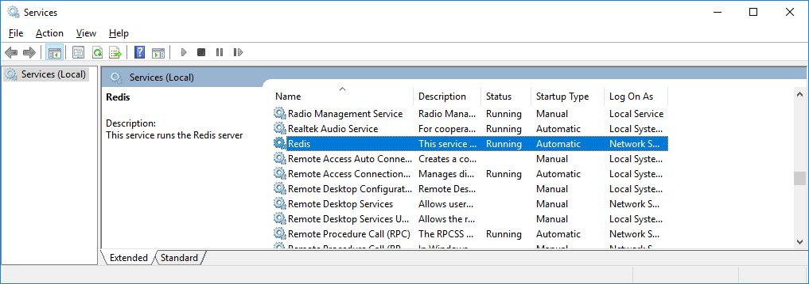
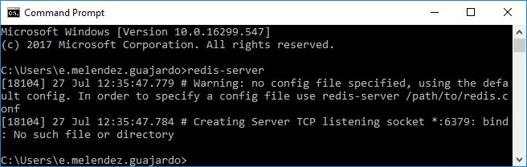

# :basketball: **Golden State Warriors Microservices** :trophy::trophy::trophy::trophy::trophy::trophy:
-------------------------
This project aims to provide all services needed by applications built for the Golden State Warriors Team.
## **Project Status**
This project is an active project, as of now you can find more information on this sites:

* Jira (Issue/Devlopment tracking): https://gsw2018.atlassian.net/secure/RapidBoard.jspa?rapidView=4&projectKey=MIC&view=planning.nodetail
* Confluence (Documentation): https://gsw2018.atlassian.net/wiki/spaces/MIC/overview
* Bitbucket (Code Repository): https://bitbucket.org/gsw2018/node/src/master/
## **Project Setup**
**Requiremnts**

* Node.js v.8.11.3
* npm 5.6.0

**Instalation**

To run the project locally you're going to need three things, the codebase, a redis instance and a postgresql instance.
To Install Redis server on Windows go to https://github.com/MicrosoftArchive/redis/releases/latest
and download and Run the MSI Installer. Go trough all the installation Wizard, and to verify if the service is running, run the CLI

    redis-cli

If the redis server (Service) it's not running try looking for the service and start it automatically, either by going into the services window and start the service Manually

or by running in a command line

    redis-server

To install Postgress you can download it directly from the postgress page: https://www.postgresql.org/download/windows/
Which will install the postgresql server and a manager called pgAdmin4.
To run postgress simply run pgAdmin4.exe located in `Program Files (x86)\pgAdmin 4\v3\runtime`
To download the codebase:

    git clone && cd node

Then run the install all of the dependencies with npm

    npm install

**Running the project**

Once all is setup, you can run the npm run script to start the service:

    npm start

# **License**
-------
Golden State Warriors Microservices is licensed under the Internet Sistem Consortium (ISC) software license.
